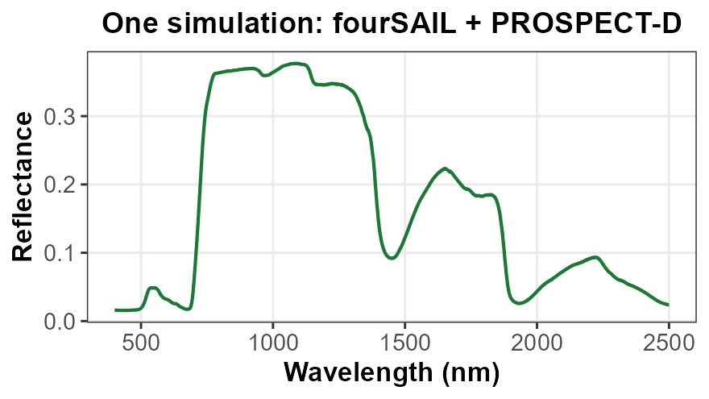

# ToolsRTM in Python

[](https://gitlab.com/caminoccg/toolsrtm) [](https://github.com/CCGCAM/RTM-Suite/tree/main/python/toolsrtm)

Python port of [`ToolsRTM`](https://gitlab.com/caminoccg/toolsrtm) (R) — **leaf and canopy radiative transfer models for optical remote sensing of vegetation**. Simulate top-of-canopy reflectance and fluorescence from leaf biochemistry and canopy structure, convolve simulated spectra to satellite and airborne sensor bands, and invert observations to retrieve biophysical traits.

Every function is verified against a real, unmodified call to the original R package — outputs match to floating-point precision unless noted otherwise. See [`verification.rst`](https://github.com/CCGCAM/RTM-Suite/blob/main/python/docs/verification.rst) for full per-function verification details.

**How this fits together:** this package is not an independent reimplementation of the R code. It is developed, tested, and verified within the same [`RTM-Suite`](https://github.com/CCGCAM/RTM-Suite) monorepo as `ToolsRTM` (R), helping both implementations remain consistent.

It complements [`scopeinpython`](https://github.com/CCGCAM/scopeinpython), the Python port of `SCOPEinR`. `scopeinpython` uses `toolsrtm` for leaf optical models such as PROSPECT-D and PROSPECT-PRO, mirroring the relationship between `SCOPEinR` and `ToolsRTM` in R.

Together, the libraries provide an end-to-end workflow for vegetation radiative transfer modelling: **leaf traits → leaf optics → canopy reflectance and fluorescence → sensor bands → SCOPE energy balance and fluorescence → retrieval of biophysical traits using classical machine learning or deep learning.**

## What's in it

| Component | What it does |
|------------------------------------|------------------------------------|
| **Leaf optics** | PROSPECT-D, PROSPECT-PRO, Fluspect-B, Fluspect-B-Cx, Liberty -- reflectance, transmittance, and (Fluspect) sun-induced fluorescence (SIF) |
| **Canopy models** | fourSAIL, fourSAIL2 (two-layer green/brown), INFORM (forest understorey) -- bidirectional canopy reflectance from LAI, leaf angle distribution, soil, and sun/view geometry |
| **Sensor convolution** | Three functions covering every real-world case: a measured SRF + atmospheric-correction coefficients (`smac.py`), a measured SRF alone (`srf.py`, PRISMA/Sentinel-2A/2B), or just nominal center+FWHM -- including **your own sensor or camera** (`srf.py`'s Gaussian convolution, also covers EnMAP, Landsat, MODIS, Hyperion, WorldView-2, ...) |
| **Spectral indices** | The common vegetation/water/pigment indices computed from a simulated or convolved spectrum |
| **Atmospheric correction** | SPART's TOC -\> TOA path via SMAC -- all 9 sensors R ships are bundled (Landsat 4/5/7/8, Sentinel-2A/B, Sentinel-3A/B, Terra/Aqua MODIS) |
| **Trait inversion** (`toolsrtm.inversion`) | CARS-PLS and VIF-based predictor selection, LUT nearest-neighbour ("merit function") matching, and a 12-algorithm ML dispatcher (PLSR/SVM/RF/GB/NN/Bayesian/AdaBag/BRNN/xGB/RVM/qLASSO/Ensemble via scikit-learn/xgboost) plus feature-selection wrappers (`hybrid_inversion`). Needs the optional `ml` extra: `pip install "toolsrtm[ml]"` |
| **Deep-learning inversion** (`toolsrtm.deep_learning`, optional) | Dense and 1D-CNN Keras architectures for trait inversion, matching R's `getMLmodel`. Not required for the rest of the package -- needs the optional `dl` extra: `pip install "toolsrtm[dl]"` (TensorFlow). scikit-learn's own estimators (above) cover most trait-inversion needs without this. |
| **Satellite retrieval** (`toolsrtm.satellite`, optional) | Search and download real scenes via STAC (Microsoft Planetary Computer or AWS Earth Search) for a bounding box/date range, and build a cropped multi-band data cube -- Sentinel-2 L2A, Landsat C2 L2, and 6 MODIS products. Needs the optional `stac` extra: `pip install "toolsrtm[stac]"` and live network access. |

`toolsrtm` is one library within [**RTM-Suite**](https://ccgcam.github.io/RTM-Suite/), which links both the R packages (`ToolsRTM`, `SCOPEinR`) and their Python ports (`toolsrtm`, `scopeinpython`) behind one common site -- with reference manuals, worked tutorials, and runnable example pipelines for both languages side by side.


The [RTM-Suite website](https://ccgcam.github.io/RTM-Suite/) -- see **Documentation** for R/Python reference manuals, **Tutorials** for step-by-step walkthroughs (R and Python side by side), and **Examples** for copy-paste runnable code with real generated figures.

## Install

``` bash
pip install git+https://github.com/CCGCAM/ToolsRTMinPython.git
```

or, editable, from a local clone:

``` bash
git clone https://github.com/CCGCAM/ToolsRTMinPython.git
cd ToolsRTMinPython
pip install -e ".[test]"
pytest tests -q
```

## Quick example

``` python
import numpy as np
from toolsrtm import foursail, compute_brf

row = dict(
    N=1.5, Cab=40, Car=8, Anth=1, Cbrown=0.1, EWT=0.01, LMA=0.009, alpha=40,
    LAI=3, hspot=0.01, LIDFa=-0.35, LIDFb=-0.15, TypeLidf=1,
    tts=30, tto=0, psi=0,
)
rsoil = np.full(2101, 0.15)

sail = foursail(row, rsoil, leaf_model="PROSPECT-D")
reflectance = compute_brf(sail.rdot, sail.rsot, row["tts"])
```

<p align="center">



</p>

Sweep a trait (e.g. chlorophyll content) and see how the whole spectrum responds:

<p align="center">


</p>

Convolve onto a real sensor's bands (here: Sentinel-2A) -- coarser and fewer bands than the native 1nm simulation, exactly what a satellite actually observes:

<p align="center">


</p>

## Documentation & tutorials

This repo is deliberately just the installable package -- everything else (manuals, worked tutorials, the course materials this was built for) lives in [`CCGCAM/RTM-Suite`](https://github.com/CCGCAM/RTM-Suite), the monorepo this package is developed and verified in and kept in sync with:

- **Manual** (every function's full docstring, browsable): [`docs/python/index.html`](https://github.com/CCGCAM/RTM-Suite/blob/main/docs/python/index.html)
- **The R tutorial series, 01-18** ([`docs/toolsrtm/articles/index.html`](https://ccgcam.github.io/RTM-Suite/toolsrtm/articles/index.html)) is this package's fullest worked-example coverage -- topic-to-module bridge, since this package doesn't mirror every R tutorial 1:1 (deliberate model differences are part of this suite's own design, not a gap):
  - Getting started / leaf-to-canopy / model comparison (R 01-02, 04) -\> `toolsrtm.leaf`, `toolsrtm.fluspect`, `toolsrtm.liberty`, `toolsrtm.canopy`, `toolsrtm.inform`
  - SPART, soil-plant-atmosphere (R 03) -\> `toolsrtm.spart`, `toolsrtm.smac`
  - Sensor convolution incl. hyperspectral/VNIR (R 07-08) -\> `toolsrtm.srf` (measured-SRF, SMAC-bundled, and Gaussian-from-nominal-characteristics convolution, matching PRISMA/Sentinel-2/EnMAP/custom-sensor coverage)
  - Vegetation indices (R 09) -\> `toolsrtm.indices`
  - Hybrid/ML inversion (R 11-12) -\> `toolsrtm.inversion`
  - Deep learning (R 13) -\> `toolsrtm.deep_learning` (TensorFlow + PyTorch, not R's single-backend `getMLmodel()`)
  - Real EO application via STAC (R 15, 17-18) -\> `toolsrtm.satellite`
  - MARMIT soil integration (R 16) -\> `toolsrtm.marmit`
  - **Not currently ported**: R's LUT-distribution helpers (`get_distributionLUT()`/`getCor()`, R Tutorial 05) and its Sobol/Johnson sensitivity tooling (R Tutorial 09-10's ToolsRTM equivalent) have no Python module yet -- a real gap, not something this package silently works around.
- **Tutorials, step by step** (simulate -\> sweep a trait -\> convolve onto a sensor, incl. your own sensor/camera -\> invert with ML, in R side-by-side with Python): [`Tutorials/How-in-Python.ipynb`](https://github.com/CCGCAM/RTM-Suite/blob/main/Tutorials/How-in-Python.ipynb) (R version: `How-in-R.Rmd`) -- matches the `Apps/RTMs` Shiny app's own **"How in Python"** tab
- **Complete R reference manual** (every leaf/canopy model, trait sampling, all 12 inversion algorithms via `caret`, TensorFlow/Keras deep learning): [`Tutorials/ToolsRTM_PROSAIL_tutorial.Rmd`](https://github.com/CCGCAM/RTM-Suite/blob/main/Tutorials/ToolsRTM_PROSAIL_tutorial.Rmd) -- the Python equivalents of its inversion sections are `toolsrtm.inversion`/`toolsrtm.deep_learning` (this package) plus the runnable pipeline scripts linked below
- **A real, runnable pipeline script** (simulate a LUT -\> compute indices -\> train an ML inversion model): [`Scripts/Python/README.md`](https://github.com/CCGCAM/RTM-Suite/blob/main/Scripts/Python/README.md)
- **Full writeup** -- every function ported, with its numerical verification status: [`python/README.md`](https://github.com/CCGCAM/RTM-Suite/blob/main/python/README.md)

### Citation

If you use **ToolsRTM** or **SCOPEinR**, please consider citing:

1.  Camino et al. (2024). **RT-Simulator: An Online Platform to Simulate Canopy Reflectance from Biochemical and Structural Plant Properties Using Radiative Transfer Models**. *IGARSS 2024*, Athens, Greece, pp. 2811-2814. [doi: 10.1109/IGARSS53475.2024.10642442](https://doi.org/10.1109/IGARSS53475.2024.10642442)

2.  Arano et al. (2024). **Enhancing Chlorophyll Content Estimation with Sentinel-2 Imagery: A Fusion of Deep Learning and Biophysical Models**. *IGARSS 2024*, Athens, Greece, pp. 4486-4489. doi: [10.1109/IGARSS53475.2024.10641613](https://doi.org/10.1109/IGARSS53475.2024.10641613)

3.  Camino et al. (in preparation). **Integrating Physiological Plant Traits with Sentinel-2 Imagery for Monitoring Gross Primary Production and Detecting Forest Disturbances**.

#### **References**

**Leaf models**

- Jacquemoud, S., Baret, F. (1990). *PROSPECT: A model of leaf optical properties spectra.* Remote Sensing of Environment, 34(2), 75-91. [10.1016/0034-4257(90)90100-Z](https://doi.org/10.1016/0034-4257(90)90100-Z)

- Féret, J.-B. et al. (2017). *PROSPECT-D: Towards modeling leaf optical properties through a complete lifecycle.* Remote Sensing of Environment, 193, 204-215. [10.1016/j.rse.2017.03.004](https://doi.org/10.1016/j.rse.2017.03.004) (PROSPECT-D, adds anthocyanins)

- Féret, J.-B. et al. (2021). *PROSPECT-PRO for estimating content of nitrogen-containing leaf proteins and other carbon-based constituents.* Remote Sensing of Environment, 252, 112173. [10.1016/j.rse.2020.112173](https://doi.org/10.1016/j.rse.2020.112173) (PROSPECT-PRO, splits dry matter into protein + carbon-based constituents)

- Dawson, T.P., Curran, P.J., Plummer, S.E. (1998). *LIBERTY — Modelling the effects of leaf biochemical concentration on reflectance spectra.* Remote Sensing of Environment, 65(1), 50-60. [10.1016/S0034-4257(98)00007-8](https://doi.org/10.1016/S0034-4257(98)00007-8)

- Vilfan, N., van der Tol, C., Muller, O., Rascher, U., Verhoef, W. (2016). *Fluspect-B: A model for leaf fluorescence, reflectance and transmittance spectra.* Remote Sensing of Environment, 186, 596-615. [10.1016/j.rse.2016.09.017](https://doi.org/10.1016/j.rse.2016.09.017)

- Vilfan, N., Van der Tol, C., Yang, P., Wyber, R., Malenovský, Z., Robinson, S.A., Verhoef, W. (2018). *Extending Fluspect to simulate xanthophyll driven leaf reflectance dynamics.* Remote Sensing of Environment, 211, 345-356. [10.1016/j.rse.2018.04.012](https://doi.org/10.1016/j.rse.2018.04.012) (Fluspect-B-Cx, adds the xanthophyll/Cx de-epoxidation state)

**Canopy models**

- Verhoef, W. (1984). *Light scattering by leaf layers with application to canopy reflectance modeling: The SAIL model.* Remote Sensing of Environment, 16(2), 125-141. [10.1016/0034-4257(84)90057-9](https://doi.org/10.1016/0034-4257(84)90057-9)

- Verhoef, W. (1998). *Theory of radiative transfer models applied in optical remote sensing of vegetation canopies.* PhD thesis, Wageningen University. (4SAIL, the extended/corrected SAIL version this suite's `fourSAIL` implements)

- Verhoef, W., Bach, H. (2007). *Coupled soil-leaf-canopy and atmosphere radiative transfer modeling to simulate hyperspectral multi-angular surface reflectance and TOA radiance data.* Remote Sensing of Environment, 109, 166-182. [10.1016/j.rse.2006.12.013](https://doi.org/10.1016/j.rse.2006.12.013) (introduces 4SAIL2, this suite's `fourSAIL2`)

- Atzberger, C. (2000). *Development of an invertible forest reflectance model: The INFOR-model.* In: *A Decade of Trans-European Remote Sensing Cooperation*, Proceedings of the 20th EARSeL Symposium, Dresden, Germany, 39-44. (no DOI, conference proceedings)

**Soil, atmosphere & SCOPE**

- Bablet, A., Vu, P.V.H., Jacquemoud, S., Viallefont-Robinet, F., Fabre, S., Briottet, X., Sadeghi, M., Whiting, M.L., Baret, F., Tian, J. (2018). *MARMIT: a multilayer radiative transfer model of soil reflectance to estimate surface soil moisture content in the solar domain (400-2500 nm).* Remote Sensing of Environment, 217:1-17. [10.1016/j.rse.2018.07.031](https://doi.org/10.1016/j.rse.2018.07.031)

- Dupiau, A., Jacquemoud, S., Briottet, X., Fabre, S., Viallefont-Robinet, F., Philpot, W., Di Biagio, C., Hébert, H., Formenti, P. (2022). *MARMIT-2: an improved version of the MARMIT model to predict soil reflectance as a function of surface water content in the solar domain.* Remote Sensing of Environment, 272:112951. [10.1016/j.rse.2022.112951](https://doi.org/10.1016/j.rse.2022.112951)

- Rahman, H., Dedieu, G. (1994). *SMAC: a simplified method for the atmospheric correction of satellite measurements in the solar spectrum.* International Journal of Remote Sensing, 15(1), 123-143.

- Yang, P., van der Tol, C., Yin, T., Verhoef, W. (2020). *The SPART model: A soil-plant-atmosphere radiative transfer model for satellite measurements in the solar spectrum.* Remote Sensing of Environment, 247, 111870. [10.1016/j.rse.2020.111870](https://doi.org/10.1016/j.rse.2020.111870)

- Van der Tol, C., Verhoef, W., Timmermans, J., Verhoef, A., Su, Z. (2009). *An integrated model of soil-canopy spectral radiances, photosynthesis, fluorescence, temperature and energy balance.* Biogeosciences 6(12), 3109-29. [10.5194/bg-6-3109-2009](https://doi.org/10.5194/bg-6-3109-2009)

- Yang, P., Prikaziuk, E., Verhoef, W., van der Tol, C. (2021). *SCOPE 2.0: A model to simulate vegetated land surface fluxes and satellite signals.* Geoscientific Model Development, 14, 4697-4712. [10.5194/gmd-14-4697-2021](https://doi.org/10.5194/gmd-14-4697-2021)

## License

[](#0) [](#0) [](#0)

`toolsrtm` is a Python port of several radiative transfer models bundled behind one common interface, and not all of them carry the same license. Three of the bundled models -- **Fluspect-B**, **fourSAIL2**, and **SPART** -- are ports of GPL-3.0-licensed original models, and GPL-3.0 requires any combined work incorporating GPL-3.0 code to be distributed as GPL-3.0 as a whole. `toolsrtm` is therefore distributed under **GPL-3.0-only** (see [`LICENSE`](LICENSE)), matching its R sibling package `ToolsRTM`'s own `License: GPL-3` field.

Within that GPL-3.0 distribution, two kinds of code coexist:

- **The ported radiative transfer models themselves** (`leaf`, `liberty`, `fluspect`, `canopy`, `inform`, listed individually in [`THIRD_PARTY_LICENSES.md`](THIRD_PARTY_LICENSES.md)) -- GPL-3.0 for the three GPL-derived ports above, and independently MIT-licensable for the rest (e.g. PROSPECT-D/-PRO in `leaf`).
- **Original utilities Carlos Camino wrote on top of those models** -- sensor convolution (`srf`, `smac`), spectral indices (`indices`), satellite/STAC retrieval (`satellite`), and the trait-inversion tooling (`inversion`, `deep_learning`) -- are original, independent work and are **MIT** individually. Because GPL-3.0 requires the combined, distributed package to be GPL-3.0 as a whole, the package you `pip install` is still GPL-3.0-only end to end; the MIT notice above is about authorship/reuse of those specific original modules on their own, not a separate installable subset.

See [`THIRD_PARTY_LICENSES.md`](THIRD_PARTY_LICENSES.md) for the license and source-code provenance of every individual model this package implements. Always cite the original publication(s) of each model you use, in addition to citing RTM-Suite/ToolsRTM.
